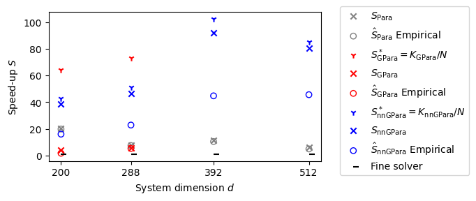

# Nearest Neighbors GParareal: Improving Scalability Of Gaussian Processes For Parallel In Time Solvers

This repository is the official implementation of [Nearest Neighbors GParareal: Improving Scalability Of Gaussian Processes For Parallel In Time Solvers](https://arxiv.org/abs/2405.12182). Authors: Guglielmo Gattiglio, Lyudmila Grigoryeva, and Massimiliano Tamborrino. 

>In this work we introduce nearest neighbors (nn) GParareal (nnGParareal), a novel data-enriched parallel-in-time (PinT) integration algorithm. nnGParareal builds upon GParareal, another PinT, by improving its scalability properties for higher-dimensional systems and increased processor count. This translates into sensibly faster parallel speed-up gains, compared to both Parareal and GParareal, over a range of systems
<!--  -->

 <p align="center">
  
&nbsp; &nbsp; 
  
  <!-- <p align="center"> Speed-up analysis of Non-linear Hopf Bifurcation system (left) and FitzHugh-Nagumo Equations (right). $a+ \hat{b}$</p> -->
</p>

Speed-up analysis of Non-linear Hopf Bifurcation system (left) and FitzHugh-Nagumo Equations (right). Legend: upper bound $S_{\rm alg}^*$ (dotted lines), theoretical $S_{\rm alg}$ (dashed lines) and empirical $\hat S_{\rm alg}$ (solid lines) speed-up values for alg = Para, GPara and nnGPara, standing for Parareal, GParareal, and nnGParareal, respectively.


## Requirements

The code was run using python 3.10. To install requirements:

```setup
pip install -r requirements.txt
```


## Results

The code and outputs to fully replicate the tables and figures in the paper are provided. Each file will usually contain both the code to run the experiment, and the analysis. They are orgained as follows:
- `Figure_*.py` or `Table_*.py`: code for the corresponding Figure or Table. 
- `Burgers.py`, `Hopf.py`, `TomLab.py`, `FHN_PDE.py`: code for running the corresponding scalability analysis. Additional results are provided in `Burgers_perf_across_m.py`, where the effect of $m$ on $K$ for Burgers is explored.
- `dataset_visualization.py`: code to illustrate the dataset used by nnGParareal (nearest neighbors) and the relative distance between observations.
- `nnGPara_with_time.py`: everything concerning to the "time" extension of nnGParareal.
- `Precision_plots_all_systems.py`: produces Figures 7 to 12.

Other files:
- `preprocessing.py`: some simulation outputs have been processed to make them lighter, by removing unnecessary information.


## Acknowledgments

Part of the code has been translated and adapted from [GParareal](https://github.com/kpentland/GParareal)'s Matlab implementation .

